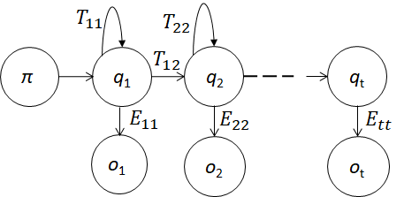

# Hidden-Markov-Model-HMM-
Hidden Markov Model (HMM) for Sequential Recognition in MATLAB.

# Introduction
The project provides HMMs for sequential recognition in MATLSB. Detection procedure is designed based on a probabilistic outlook by making use of mathematical models.Initial implementation of the code was carried out for hand activity detection by making use of surface Electromyography (sEMG) sensors. The requirement of a threshold for activity detection is obviated making it subject and activity independent. 

# Usage
Clone or Download the repository and implement the 'hmm_actdet1.m' function. 

!

# Results
! !
! !
! !

# Acknowledgment
We would like to recognize the funding support provided by the Science & Engineering Research Board, a statutory body of the Department of Science & Technology (DST), Government of India, SERB file number ECR/2016/000637.

# Reference
https://ieeexplore.ieee.org/document/8488070
